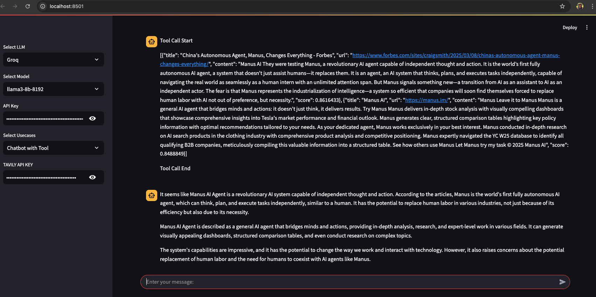

# Project Setup

## Steps

### 1. Open a New Folder

### 2. Create a New Virtual Environment

### 3. Install Requirements
```sh
pip install -r requirements.txt
```

### 4. Define Folder Structure & Commit Code to GitHub
#### a. Create a New Repository
```sh
git init
```
#### b. Add `.gitignore` and Include `venv/`
#### c. Commit One File to Establish Connection with GitHub
#### d. Verify Initial Commit in GitHub

### 5. Create `src` Folder and Make it a Package
```sh
mkdir src
```
Add `__init__.py` to make it a package.

### 6. Define Project Structure
Inside `src/`, create a folder `langgraphagenticai/` and add `__init__.py`. Inside it, create:
- `LLMs/` - `__init__.py`
- `Nodes/` - `__init__.py`
- `Graph/` - `__init__.py`
- `State/` - `__init__.py`
- `Tools/` - `__init__.py`
- `Vectorstore/` - `__init__.py`
- `ui/` - `__init__.py`
- Lastly, add `main.py`

### 7. Create `app.py` Outside `src/`
This is the main execution entry point.

## Start Writing Code

### 8. LLM Setup
#### a. Inside `LLMs/`, create `qroqllm.py` to load LLM via Streamlit UI.

### 9. UI Setup
#### a. Inside `ui/`, create:
- `loadui.py`
- `display_result.py`

#### b. Create a Config File
Inside `ui/`, create `uiconfigfile.ini` (plain text key-value pairs).

#### c. Create a Config Parser
Inside `ui/streamlit_ui/`, create `uiconfigfile.py` to read from `uiconfigfile.ini`.

#### d. Implement `loadui.py`
```python
from src.langgraphagenticai.ui.uiconfigfile import Config
```
- Load sidebar options from the config file
- Store session state
- Load UI components (left & right sections)

### 10. Running the UI
Run the UI to check if it loads correctly:
```sh
streamlit run app.py
```

### 11. Implement `main.py`
#### a. Execution starts here based on user choices.
#### b. Load the LLM in `qroqllm.py`.
#### c. Implement `graph_builder.py` inside `Graph/`.
- Import `State` inside `graph_builder.py`

#### d. Implement `Nodes`
- Start with `BasicChatbotNode`.
```python
from src.langgraphagenticai.nodes.basic_chatbot_node import BasicChatbotNode
```
- Define edges, start, and end functions.

#### e. Connect Graph in `main.py`
```python
from src.langgraphagenticai.graph.graph_builder import GraphBuilder
```
- Invoke the graph based on use case.
- Compile and stream results.

#### f. Update Display Results
Modify `display_result.py` to update UI results and call it in `main.py`.
```python
from src.langgraphagenticai.ui.streamlitui.display_result import DisplayResultStreamlit
```

### 12. Run the Application
```sh
streamlit run app.py
```
# 🚀 CI/CD Setup: GitHub to Hugging Face  

## 🔹 1. Set Up CI/CD Between GitHub and Hugging Face  
- **Create** a new Space on Hugging Face.  
- A **unique URL** will be generated for your Space.  
- Open **`main.yml`** and update the **last line**:  
  - Replace it with your Hugging Face Space **unique URL** (it will include `$HF_TOKEN`).  
- **Update the README**:  
  - The **first section** of the README should contain the **Streamlit configuration**.  

## 🔹 2. Deploy on Streamlit  
- **Go to the Streamlit website** and add your GitHub repo and branch details.  
- Deployment example:  
  👉 [LangGraph Streamlit App](https://langgraphe2e-4cg4bxcc3ysrhwrmregluy.streamlit.app/)  

---

Your CI/CD pipeline should now be set up for seamless deployment! 🚀✨  

---
# Chatbot with Tool Integration  

## 📌 Steps to Implement  

### 🔹 1. Add a Search Tool  
- Navigate to the `TOOLS` folder.  
- **Create** a new file: `search_tool.py`.  
- **Add Tavily** as a tool inside this file.  

### 🔹 2. Create a Chatbot with Tool Node  
- Navigate to the `NODES` folder.  
- **Create** a new file: `Chatbot_with_tool_node.py`.  
- Implement chatbot logic with tool integration inside this file.  

### 🔹 3. Modify Graph Builder  
- Open `graph_builder.py`.  
- **Edit** the file to include tool functionality.  

### 🔹 4. Update the UI  
- Modify the following UI components:  
  - `Load_streamlit_ui.py`  
  - `uiconfig.ini`  
  - `display_results.py`  

### 🔹 5. Run the Application  
To start the chatbot, run the following command:  
streamlit run app.py

🚀 Now your chatbot with tool integration should be live!

## Ouput Screenshots 
Streamlit UI interface showcasing chatbot utilizing tools



